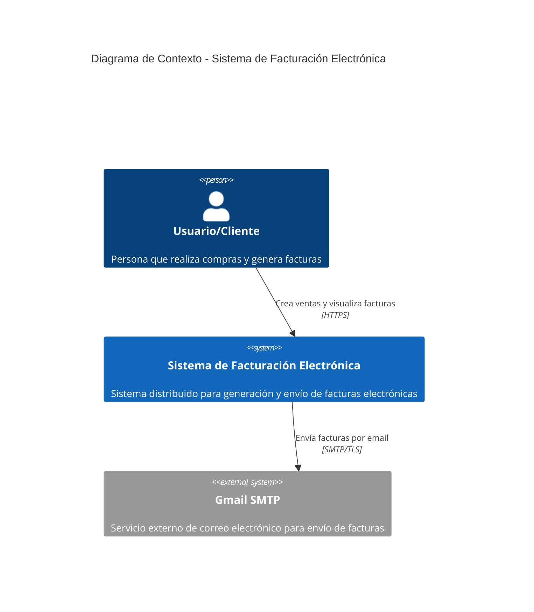
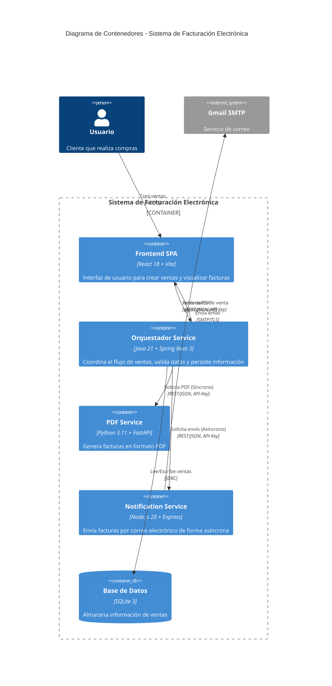
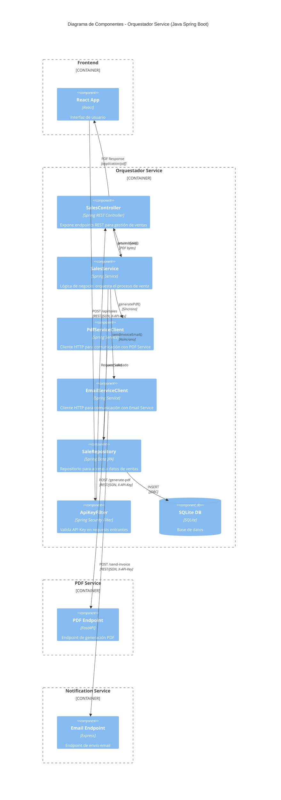
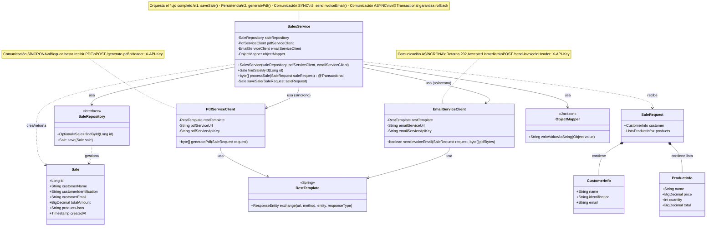
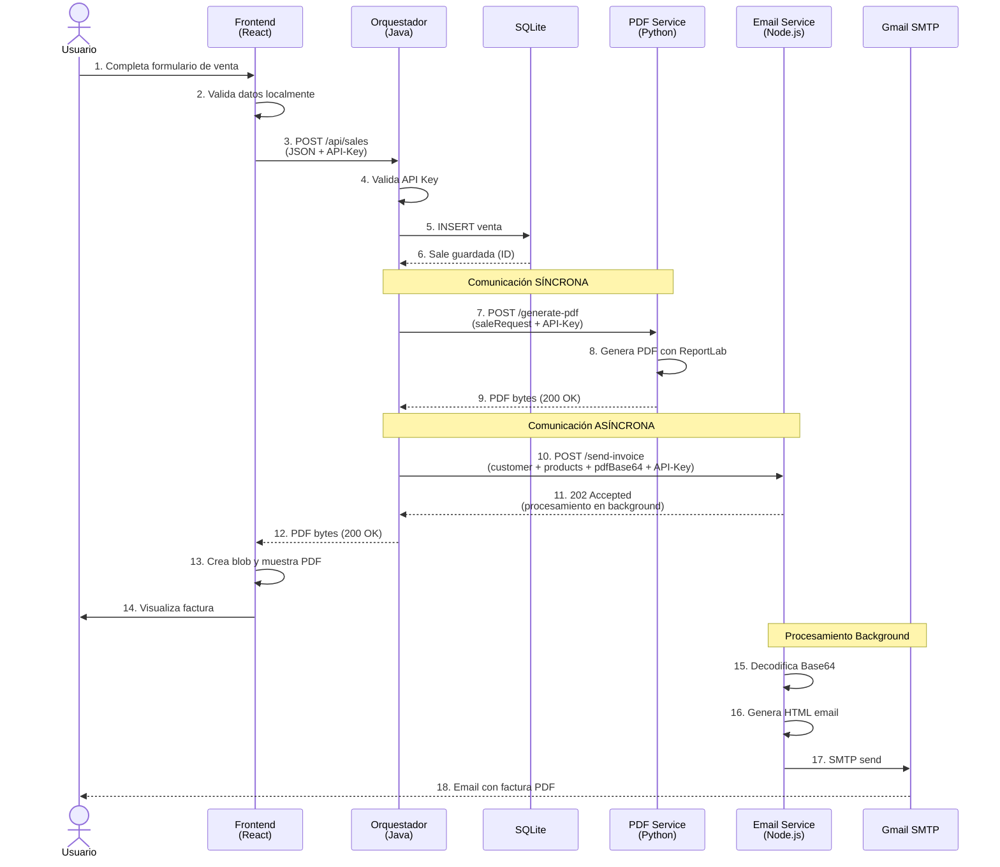

# Arquitectura C4 - Sistema de Facturación Electrónica

## Introducción

Este documento describe la arquitectura del Sistema de Facturación Electrónica utilizando el modelo C4 (Context, Containers, Components, Code). El sistema implementa una arquitectura de microservicios con diferentes tecnologías para demostrar interoperabilidad y patrones de comunicación.

---

## Nivel 1: Diagrama de contexto

El diagrama de contexto muestra cómo el sistema interactúa con usuarios y sistemas externos.



---

## Nivel 2: Diagrama de contenedores

El diagrama de contenedores muestra los principales contenedores del sistema y sus tecnologías.



---

## Nivel 3: Diagrama de componentes

El diagrama de componentes muestra la estructura interna del Orquestador Service (microservicio principal).



---

## Nivel 4: Diagrama de Código

El diagrama de código muestra la estructura interna de la clase `SalesService` con sus dependencias, métodos y relaciones.



### Descripción de la Clase `SalesService`

**Ubicación**: `orchestrator-service/src/main/java/com/invoice/orchestrator/service/SalesService.java`

#### Responsabilidades

La clase `SalesService` actúa como **orquestador principal** del sistema, implementando el patrón **Saga Orchestrator**:

1. **Coordinar el flujo completo de venta**
2. **Gestionar transacciones** con Spring `@Transactional`
3. **Integrar servicios externos** (PDF y Email)
4. **Manejar errores y compensaciones**

#### Dependencias Inyectadas

| Dependencia | Tipo | Responsabilidad |
|------------|------|-----------------|
| `saleRepository` | `SaleRepository` | Persistencia de ventas en SQLite |
| `pdfServiceClient` | `PdfServiceClient` | Generación síncrona de PDF |
| `emailServiceClient` | `EmailServiceClient` | Envío asíncrono de email |
| `objectMapper` | `ObjectMapper` | Serialización JSON de productos |

#### Métodos Públicos

**1. `processSale(SaleRequest saleRequest): byte[]`**
- **Anotación**: `@Transactional`
- **Flujo**:
  1. `saveSale()` → Persiste en BD
  2. `pdfServiceClient.generatePdf()` → Genera PDF (SYNC)
  3. `emailServiceClient.sendInvoiceEmail()` → Envía email (ASYNC)
- **Retorna**: Bytes del PDF generado
- **Excepciones**: `RuntimeException` en caso de error

**2. `findSaleById(Long id): Sale`**
- Busca una venta por su ID
- **Excepciones**: `RuntimeException` si no existe

#### Método Privado

**`saveSale(SaleRequest saleRequest): Sale`**
- Calcula total sumando `product.getTotal()` de cada producto
- Serializa productos a JSON con `ObjectMapper`
- Crea entidad `Sale` con datos del request
- Persiste usando `saleRepository.save()`

#### Flujo del Método `processSale`

```
processSale(SaleRequest)
    │
    ├─► saveSale()
    │     ├─ Calcular totalAmount (BigDecimal)
    │     ├─ Serializar productos → JSON
    │     ├─ Crear entidad Sale
    │     └─ saleRepository.save() → SQLite
    │
    ├─► pdfServiceClient.generatePdf()  [SÍNCRONO]
    │     ├─ RestTemplate.exchange()
    │     ├─ POST /generate-pdf
    │     ├─ Header: X-API-Key
    │     └─ Espera respuesta completa (byte[])
    │
    ├─► emailServiceClient.sendInvoiceEmail()  [ASÍNCRONO]
    │     ├─ Codificar PDF → Base64
    │     ├─ RestTemplate.exchange()
    │     ├─ POST /send-invoice
    │     ├─ Header: X-API-Key
    │     └─ Retorna inmediato (202 Accepted)
    │
    └─► return byte[] pdfBytes
```

#### Patrones Implementados

| Patrón | Implementación |
|--------|----------------|
| **Saga Orchestrator** | `SalesService` coordina múltiples operaciones distribuidas |
| **Comunicación Síncrona** | `PdfServiceClient` bloquea hasta recibir PDF completo |
| **Comunicación Asíncrona** | `EmailServiceClient` retorna inmediato (fire-and-forget) |
| **Transaction Management** | `@Transactional` garantiza rollback en errores |
| **Dependency Injection** | Constructor injection con Spring |

#### Manejo de Errores

- **Exception Handling**: Try-catch en `processSale()`
- **Transaction Rollback**: `@Transactional` revierte cambios en BD si hay error
- **Compensación** (comentado): Código indica dónde implementar Saga compensation
- **Logging**: Console output para trazabilidad

#### Tipos de Comunicación

| Servicio | Tipo | Razón |
|----------|------|-------|
| **PDF Service** | Síncrona | El PDF es esencial para responder al cliente |
| **Email Service** | Asíncrona | El envío de email no es crítico, se procesa en background |

---

## Patrones y conceptos arquitectónicos

### Patrones implementados

1. **API Gateway Pattern**
   - El Orquestador actúa como punto de entrada único
   - Coordina llamadas a múltiples servicios backend

2. **Service-to-Service Authentication**
   - Uso de API Keys en header `X-API-Key`
   - Validación mediante middleware/filtros en cada servicio

3. **Polyglot Persistence**
   - Solo el servicio Orquestador tiene base de datos
   - Servicios PDF y Email son stateless

4. **Backend for Frontend (BFF)**
   - El Orquestador adapta las respuestas para el frontend
   - Devuelve directamente el PDF como bytes

### Comunicación entre servicios

#### Comunicación síncrona (PDF service)
- **Protocolo**: HTTP REST
- **Timeout**: Configurado en RestTemplate (comentado en código)
- **Manejo de errores**: Excepción detiene todo el flujo
- **Use Case**: Cuando la respuesta es esencial para continuar

```
Frontend → Orquestador → PDF Service
              ↓ (espera)
         PDF generado
              ↓
          Frontend
```

#### Comunicación asíncrona (Email service)
- **Protocolo**: HTTP REST con status 202 (Accepted)
- **Fire and Forget**: No espera finalización del envío
- **Manejo de Errores**: Fallo no detiene el flujo principal
- **Background Processing**: Email se envía usando `setImmediate()` en Node.js

```
Frontend → Orquestador → Email Service (202 Accepted)
              ↓              ↓ (background)
         PDF al           Envío SMTP
          Frontend         (asíncrono)
```

### Seguridad

1. **API Key Validation**
   - Cada microservicio valida el header `X-API-Key`
   - Implementado en:
     - Java: `ApiKeyFilter` (Spring Security Filter)
     - Python: `ApiKeyMiddleware` (Starlette Middleware)
     - Node.js: `apiKeyMiddleware` (Express Middleware)

2. **CORS Configuration**
   - Configurado en todos los servicios
   - Permite requests desde el frontend

### Tecnologías por servicio

| Servicio | Framework | Puerto | Base de Datos | Comunicación |
|----------|-----------|--------|---------------|--------------|
| Frontend | React 18 + Vite | 5173 | - | HTTP Client |
| Orquestador | Spring Boot 3 + Java 21 | 8080 | SQLite | RestTemplate |
| PDF Service | FastAPI + Python 3.11 | 8081 | - | HTTP |
| Email Service | Express + Node.js 20 | 8082 | - | Nodemailer (SMTP) |

---

## Flujo completo de una venta



### Descripción del flujo:

1. **Interacción Usuario-Frontend** (Pasos 1-3)
   - Usuario ingresa datos de cliente y productos
   - Frontend valida formato de email y campos requeridos
   - Calcula totales automáticamente
   - Envía request REST con API-Key

2. **Procesamiento en orquestador** (Pasos 4-6)
   - Valida autenticación mediante API Key Filter
   - Parsea y valida datos con Bean Validation
   - Serializa productos a JSON
   - Persiste venta en SQLite

3. **Generación de PDF síncrona** (Pasos 7-9)
   - Orquestador envía request al PDF Service
   - PDF Service valida API Key
   - Genera PDF usando ReportLab (Python)
   - **Orquestador espera** la respuesta completa
   - Recibe bytes del PDF

4. **Envío de email asíncrono** (Pasos 10-11)
   - Orquestador codifica PDF a Base64
   - Envía request al Email Service
   - Email Service responde **inmediatamente** con 202
   - **Orquestador NO espera** el envío real

5. **Respuesta al frontend** (Pasos 12-14)
   - Orquestador retorna PDF directamente
   - Frontend crea Blob URL
   - Muestra PDF en iframe
   - Usuario puede descargar

6. **Procesamiento background email** (Pasos 15-18)
   - Email Service decodifica Base64
   - Genera HTML con tabla de productos
   - Envía via SMTP a Gmail
   - Usuario recibe email con PDF adjunto

---

## Consideraciones de producción

### Patrones no implementados (POC)

Los siguientes patrones están **comentados en el código** para implementación futura:

1. **Circuit Breaker**
   - Ubicación: `PdfServiceClient.java:32-33`
   - Propósito: Evitar llamadas a servicios caídos

2. **Retry Pattern**
   - Ubicación: `PdfServiceClient.java:35-36`
   - Propósito: Reintentar operaciones fallidas con backoff exponencial

3. **Message Queue**
   - Ubicación: `EmailServiceClient.java:34-35`
   - Propósito: Usar RabbitMQ/Kafka para garantizar entrega

4. **Dead Letter Queue**
   - Ubicación: `EmailServiceClient.java:79`, `email.service.js:158`
   - Propósito: Reintentar emails fallidos

5. **Compensating Transactions**
   - Ubicación: `SalesService.java:87`
   - Propósito: Rollback distribuido en caso de fallo parcial

6. **Health Checks**
   - Implementado básico en `/health`
   - Falta: Checks de dependencias (DB, servicios externos)

7. **Service Discovery**
   - Actual: URLs hardcodeadas
   - Futuro: Eureka, Consul

### Escalabilidad

**Servicios Stateless** (pueden escalar horizontalmente):
- PDF Service (Python)
- Email Service (Node.js)

**Servicios con estado**:
- Orquestador: SQLite (migrar a PostgreSQL/MySQL para múltiples instancias)

### Observabilidad

Para producción se requiere:
- **Distributed Tracing**: Jaeger, Zipkin
- **Centralized Logging**: ELK Stack, Splunk
- **Metrics**: Prometheus + Grafana
- **Correlation IDs**: Para seguir requests entre servicios

---

## Comandos de ejecución

### Docker Compose (recomendado)

```bash
# Iniciar todos los servicios
docker-compose up --build

# Ver logs
docker-compose logs -f

# Detener servicios
docker-compose down
```

### Ejecución local

**Orquestador (Java)**
```bash
cd orchestrator-service
mvn spring-boot:run
```

**PDF service (Python)**
```bash
cd pdf-service
python -m venv venv
source venv/bin/activate  # Windows: venv\Scripts\activate
pip install -r requirements.txt
uvicorn app.main:app --host 0.0.0.0 --port 8081
```

**Email service (Node.js)**
```bash
cd notification-service
npm install
npm start
```

**Frontend (React)**
```bash
cd frontend
npm install
npm run dev
```

---

## Referencias

- **Código fuente**: Ver directorio del proyecto
- **Documentación API**:
  - Orquestador: http://localhost:8080/swagger-ui.html
  - PDF Service: http://localhost:8081/docs