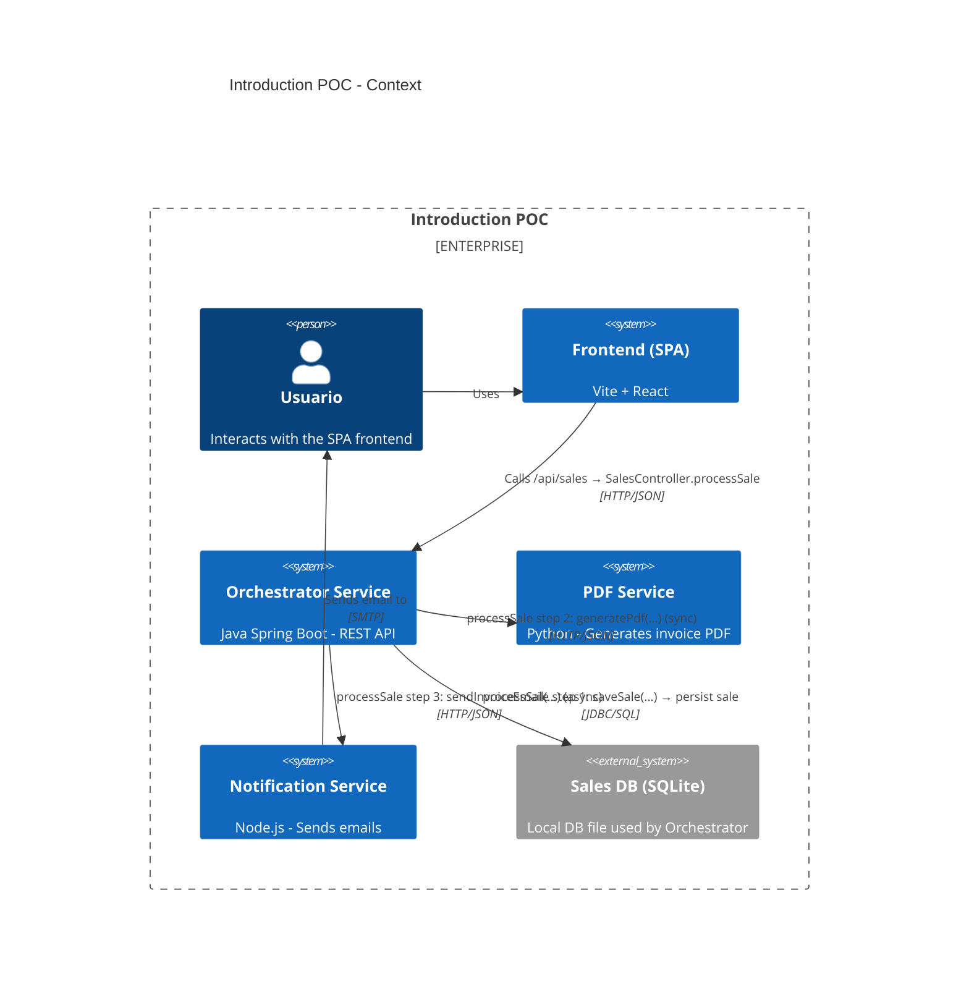
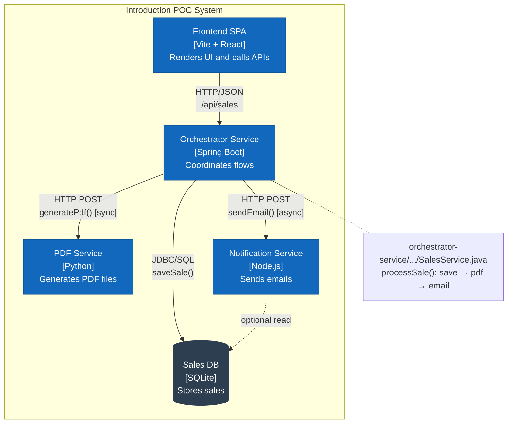
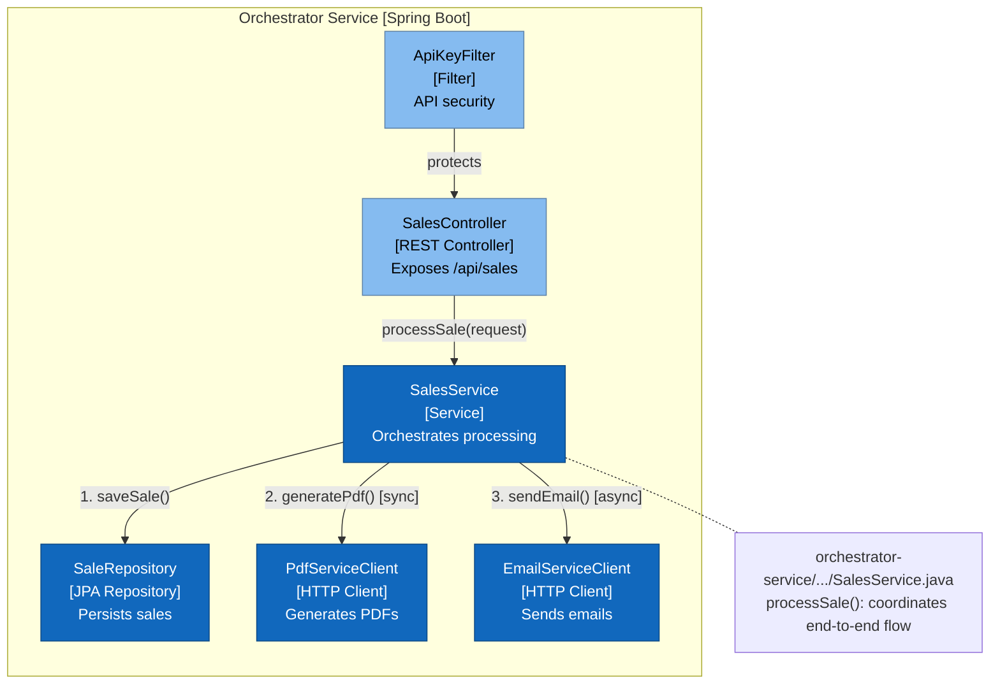
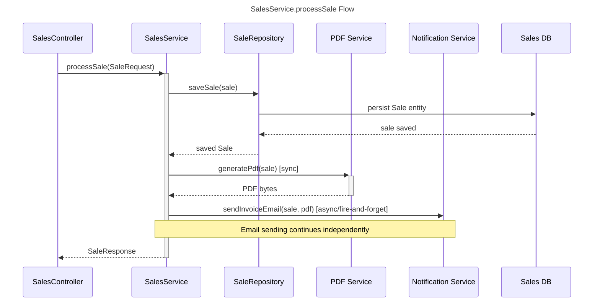

# Arquitectura C4 — Introduction POC

Este documento agrupa los diagramas C4 en Mermaid y explica el flujo principal implementado por `SalesService.processSale` en el microservicio orquestador.

---

## Context (C4Context)

---

## Containers (C4Container)

---

## Component (C4Component) — Orchestrator Service

---

## Flujo `processSale` (C4Code)

El diagrama muestra el flujo orquestador implementado por `SalesService.processSale(SaleRequest)`:

1. **Persistencia**: La venta se guarda en la base de datos a través de `saveSale(...)` (serializa productos a JSON).
2. **PDF**: Se solicita al `pdf-service` la generación síncrona de la factura.
3. **Email**: Se envía una petición asíncrona al `notification-service` para el envío del email.

El flujo principal continúa incluso si el envío del email falla, ya que la venta persiste en base de datos.