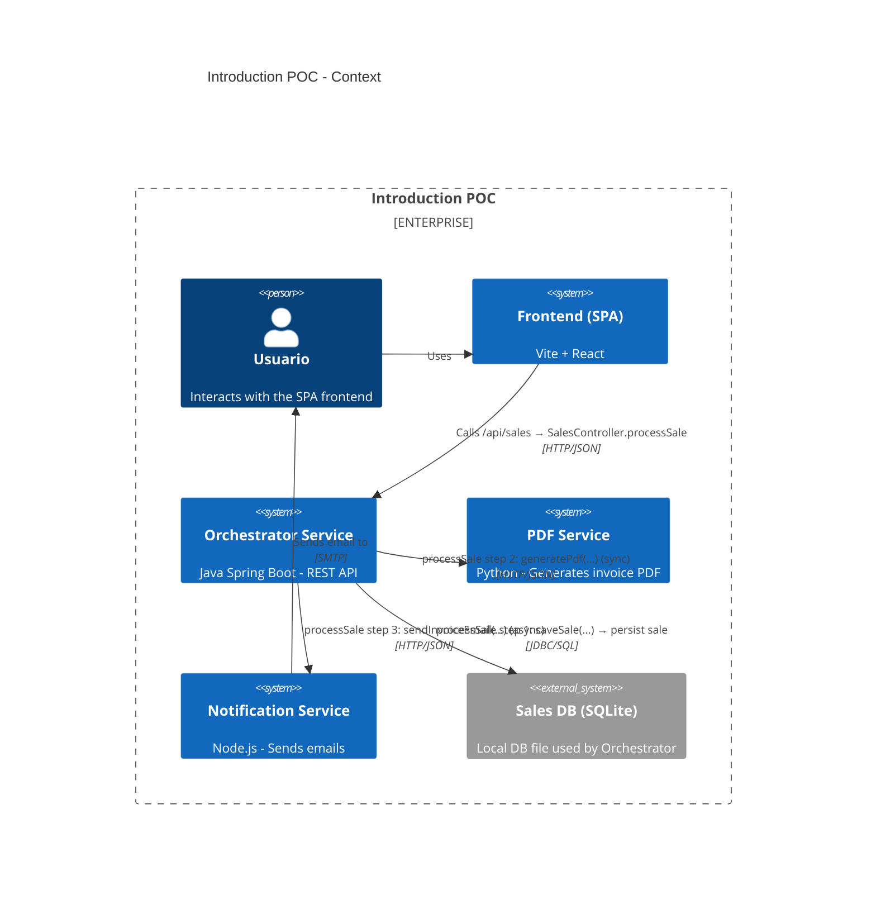
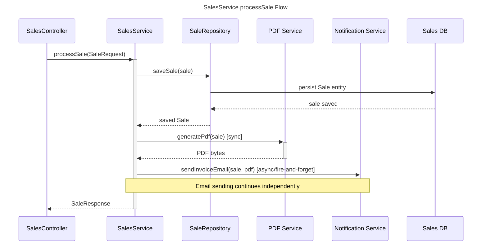

# Arquitectura C4 — Introduction POC

Este documento agrupa los diagramas C4 en Mermaid y explica el flujo principal implementado por `SalesService.processSale` en el microservicio orquestador.

---

## Context (C4Context)



---

## Containers (C4Container)

```mermaid
C4Container
  title Introduction POC - Containers
  Container(browser, "Frontend SPA", "Vite + React", "Renders UI and calls Orchestrator APIs")
  Container(orchestrator, "Orchestrator Service", "Spring Boot (Java)", "Exposes /api/sales and coordinates PDF & Email flows")
  Container(pdfsvc, "PDF Service", "Python", "/generate-pdf - returns PDF bytes")
  Container(notification, "Notification Service", "Node.js", "/email/send - queues/sends emails")
  Container_Db(sqldb, "Sales DB", "SQLite", "Persisted sales")

  Rel(browser, orchestrator, "HTTP JSON - calls /api/sales (SalesController.processSale)")
  Rel(orchestrator, sqldb, "JDBC/SQL - saveSale(...) persists sale")
  Rel(orchestrator, pdfsvc, "HTTP POST - generatePdf(...) (synchronous)")
  Rel(orchestrator, notification, "HTTP POST - sendInvoiceEmail(...) (fire-and-forget)")
  Rel(notification, sqldb, "(optional) read sales metadata if needed")

  Note(orchestrator, "See: orchestrator-service/src/main/java/com/invoice/orchestrator/service/SalesService.java\nMethod: processSale(SaleRequest)\nFlow: saveSale → generatePdf (sync) → sendInvoiceEmail (async)")
```

---

## Component (C4Component) — Orchestrator Service

```mermaid
C4Component
  title Orchestrator Service - Components
  Container(orchestrator, "Orchestrator Service", "Spring Boot", "")

  Component(api, "SalesController", "REST Controller", "Exposes /api/sales and delegates to SalesService")
  Component(service, "SalesService", "Service", "Orchestrates sale processing: save → pdf → email")
  Component(repo, "SaleRepository", "JPA Repository", "Persists Sale entities to SQLite")
  Component(pdfClient, "PdfServiceClient", "HTTP Client", "Calls PDF service")
  Component(emailClient, "EmailServiceClient", "HTTP Client", "Calls Notification service")
  Component(security, "ApiKeyFilter", "Filter", "Protects endpoints via API key")

  Rel(api, service, "calls → processSale(saleRequest)")
  Rel(service, repo, "step 1 → saveSale(...) persists sale")
  Rel(service, pdfClient, "step 2 → pdfServiceClient.generatePdf(...) (sync)")
  Rel(service, emailClient, "step 3 → emailServiceClient.sendInvoiceEmail(...) (async)")
  Rel(security, api, "protects → API endpoints")

  Note(service, "Implementation: orchestrator-service/src/main/java/com/invoice/orchestrator/service/SalesService.java\nMethod: processSale(SaleRequest) - coordinates the end-to-end flow (save, pdf, email)")
```

---

## Flujo `processSale` (C4Code)



El diagrama muestra el flujo orquestador implementado por `SalesService.processSale(SaleRequest)`:

1. **Persistencia**: La venta se guarda en la base de datos a través de `saveSale(...)` (serializa productos a JSON).
2. **PDF**: Se solicita al `pdf-service` la generación síncrona de la factura.
3. **Email**: Se envía una petición asíncrona al `notification-service` para el envío del email.

El flujo principal continúa incluso si el envío del email falla, ya que la venta está persistida.