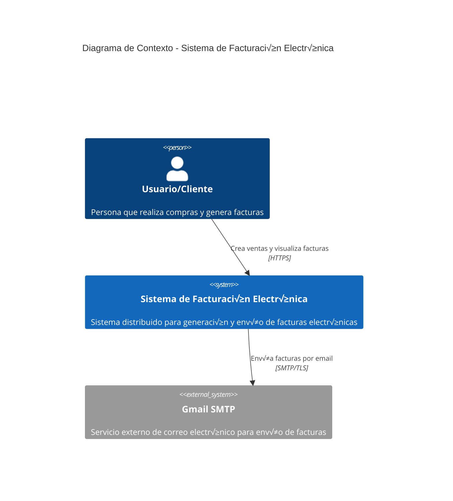
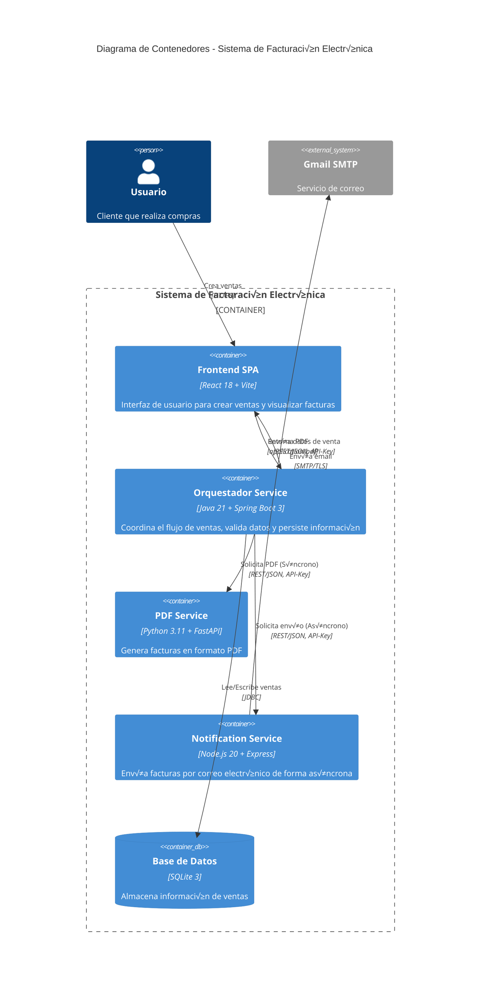
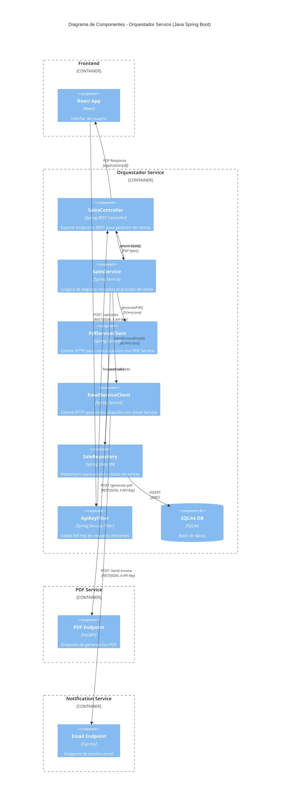
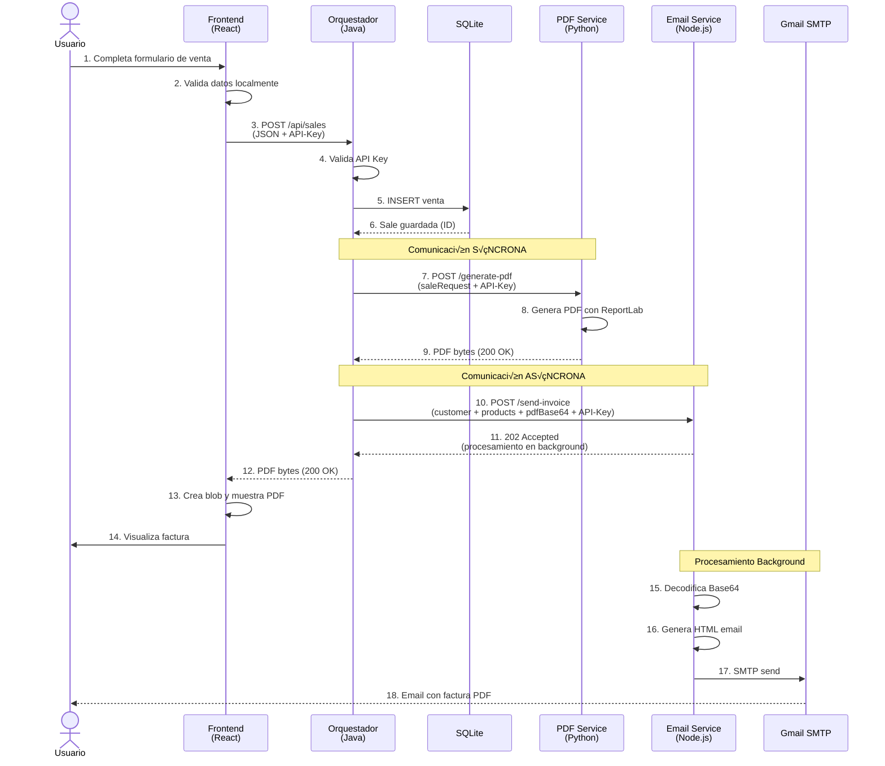

# Arquitectura C4 - Sistema de Facturación Electrónica

## Introducción

Este documento describe la arquitectura del Sistema de Facturación Electrónica utilizando el modelo C4 (Context, Containers, Components, Code). El sistema implementa una arquitectura de microservicios con diferentes tecnologías para demostrar interoperabilidad y patrones de comunicación.

---

## Nivel 1: Diagrama de contexto

El diagrama de contexto muestra cómo el sistema interactúa con usuarios y sistemas externos.


```mermaid
C4Context
    title Diagrama de Contexto - Sistema de Facturación Electrónica

    Person(cliente, "Usuario/Cliente", "Persona que realiza compras y genera facturas")

    System(sistemaFacturacion, "Sistema de Facturación Electrónica", "Sistema distribuido para generación y envío de facturas electrónicas")

    System_Ext(servicioEmail, "Gmail SMTP", "Servicio externo de correo electrónico para envío de facturas")

    Rel(cliente, sistemaFacturacion, "Crea ventas y visualiza facturas", "HTTPS")
    Rel(sistemaFacturacion, servicioEmail, "Envía facturas por email", "SMTP/TLS")

    UpdateLayoutConfig($c4ShapeInRow="2", $c4BoundaryInRow="1")
```

---

## Nivel 2: Diagrama de contenedores

El diagrama de contenedores muestra los principales contenedores del sistema y sus tecnologías.


```mermaid
C4Container
    title Diagrama de Contenedores - Sistema de Facturación Electrónica

    Person(usuario, "Usuario", "Cliente que realiza compras")

    Container_Boundary(sistemaBoundary, "Sistema de Facturación Electrónica") {
        Container(frontend, "Frontend SPA", "React 18 + Vite", "Interfaz de usuario para crear ventas y visualizar facturas")

        Container(orquestador, "Orquestador Service", "Java 21 + Spring Boot 3", "Coordina el flujo de ventas, valida datos y persiste información")

        Container(pdfService, "PDF Service", "Python 3.11 + FastAPI", "Genera facturas en formato PDF")

        Container(emailService, "Notification Service", "Node.js 20 + Express", "Envía facturas por correo electrónico de forma asíncrona")

        ContainerDb(database, "Base de Datos", "SQLite 3", "Almacena información de ventas")
    }

    System_Ext(gmail, "Gmail SMTP", "Servicio de correo")

    Rel(usuario, frontend, "Crea ventas", "HTTPS")
    Rel(frontend, orquestador, "Envía datos de venta", "REST/JSON, API-Key")

    Rel(orquestador, database, "Lee/Escribe ventas", "JDBC")
    Rel(orquestador, pdfService, "Solicita PDF (Síncrono)", "REST/JSON, API-Key")
    Rel(orquestador, emailService, "Solicita envío (Asíncrono)", "REST/JSON, API-Key")

    Rel(emailService, gmail, "Envía email", "SMTP/TLS")
    Rel(orquestador, frontend, "Retorna PDF", "application/pdf")

    UpdateLayoutConfig($c4ShapeInRow="3", $c4BoundaryInRow="1")
```

---

## Nivel 3: Diagrama de componentes

El diagrama de componentes muestra la estructura interna del Orquestador Service (microservicio principal).


```mermaid
C4Component
    title Diagrama de Componentes - Orquestador Service (Java Spring Boot)

    Container_Boundary(frontend, "Frontend") {
        Component(reactApp, "React App", "React", "Interfaz de usuario")
    }

    Container_Boundary(orquestadorBoundary, "Orquestador Service") {
        Component(salesController, "SalesController", "Spring REST Controller", "Expone endpoints REST para gestión de ventas")

        Component(salesService, "SalesService", "Spring Service", "Lógica de negocio: orquesta el proceso de venta")

        Component(pdfClient, "PdfServiceClient", "Spring Service", "Cliente HTTP para comunicación con PDF Service")

        Component(emailClient, "EmailServiceClient", "Spring Service", "Cliente HTTP para comunicación con Email Service")

        Component(saleRepository, "SaleRepository", "Spring Data JPA", "Repositorio para acceso a datos de ventas")

        Component(apiKeyFilter, "ApiKeyFilter", "Spring Security Filter", "Valida API Key en requests entrantes")

        ComponentDb(sqliteDB, "SQLite DB", "SQLite", "Base de datos")
    }

    Container_Boundary(pdfBoundary, "PDF Service") {
        Component(pdfEndpoint, "PDF Endpoint", "FastAPI", "Endpoint de generación PDF")
    }

    Container_Boundary(emailBoundary, "Notification Service") {
        Component(emailEndpoint, "Email Endpoint", "Express", "Endpoint de envío email")
    }

    Rel(reactApp, apiKeyFilter, "POST /api/sales", "REST/JSON, X-API-Key")
    Rel(apiKeyFilter, salesController, "Request validado", "")
    Rel(salesController, salesService, "processSale()", "")

    Rel(salesService, saleRepository, "save(Sale)", "")
    Rel(saleRepository, sqliteDB, "INSERT", "JDBC")

    Rel(salesService, pdfClient, "generatePdf()", "Síncrono")
    Rel(pdfClient, pdfEndpoint, "POST /generate-pdf", "REST/JSON, X-API-Key")

    Rel(salesService, emailClient, "sendInvoiceEmail()", "Asíncrono")
    Rel(emailClient, emailEndpoint, "POST /send-invoice", "REST/JSON, X-API-Key")

    Rel(salesService, salesController, "return byte[]", "PDF bytes")
    Rel(salesController, reactApp, "PDF Response", "application/pdf")

    UpdateLayoutConfig($c4ShapeInRow="3", $c4BoundaryInRow="1")
```

---

## Nivel 4: Diagrama de código

El diagrama de código muestra el flujo detallado del método `processSale` de la clase `SalesService`.


```mermaid
flowchart TD
    Start([Inicio: processSale]) --> Log1[üìù Log: Iniciando procesamiento de venta]

    Log1 --> Step1[🔄 Paso 1: saveSale]
    Step1 --> CalcTotal[Calcular totalAmount<br/>suma de productos]
    CalcTotal --> SerializeJSON[Serializar productos a JSON<br/>ObjectMapper.writeValueAsString]
    SerializeJSON --> CreateEntity[Crear entidad Sale:<br/>- customerName<br/>- customerIdentification<br/>- customerEmail<br/>- totalAmount<br/>- productsJson]
    CreateEntity --> SaveDB[(saleRepository.save)]
    SaveDB --> LogDB[üìù Log: Venta guardada con ID]

    LogDB --> Step2[🔄 Paso 2: pdfServiceClient.generatePdf]
    Step2 --> PrepHeaders1[Preparar headers:<br/>Content-Type: application/json<br/>X-API-Key: pdfServiceApiKey]
    PrepHeaders1 --> HTTPPost1[POST http://pdf-service:8081/generate-pdf]
    HTTPPost1 --> WaitPDF[⏳ ESPERAR respuesta<br/>COMUNICACIÓN SÍNCRONA]
    WaitPDF --> CheckPDF{Status == 200<br/>y body != null?}

    CheckPDF -->|No| ErrorPDF[‚ùå throw RuntimeException<br/>Error al generar PDF]
    CheckPDF -->|Sí| LogPDF[📝 Log: PDF generado exitosamente]

    LogPDF --> Step3[🔄 Paso 3: emailServiceClient.sendInvoiceEmail]
    Step3 --> EncodeB64[Codificar PDF a Base64<br/>Base64.encode pdfBytes]
    EncodeB64 --> PrepPayload[Preparar payload:<br/>- customer<br/>- products<br/>- pdfBase64]
    PrepPayload --> PrepHeaders2[Preparar headers:<br/>Content-Type: application/json<br/>X-API-Key: emailServiceApiKey]
    PrepHeaders2 --> HTTPPost2[POST http://email-service:8082/send-invoice]
    HTTPPost2 --> CheckEmail{Status == 202<br/>ACCEPTED?}

    CheckEmail -->|Sí| LogEmailOK[📝 Log: Email aceptado<br/>procesamiento asíncrono]
    CheckEmail -->|No| LogEmailWarn[⚠️ Log: Respuesta inesperada<br/>operación no crítica]

    LogEmailOK --> LogSuccess[üìù Log: Venta procesada exitosamente]
    LogEmailWarn --> LogSuccess

    LogSuccess --> Return[‚úÖ return pdfBytes]
    Return --> End([Fin])

    ErrorPDF --> Catch[‚ùå catch Exception]
    Step1 -.->|Error| Catch
    Step2 -.->|Error| Catch

    Catch --> LogError[üìù Log: Error al procesar venta]
    LogError --> Compensate[💡 PATRON: Aquí se implementaría<br/>compensación rollback]
    Compensate --> Throw[‚ùå throw RuntimeException<br/>Error al procesar la venta]
    Throw --> End

    style Start fill:#2ECC71,stroke:#27AE60,stroke-width:3px,color:#fff
    style End fill:#E74C3C,stroke:#C0392B,stroke-width:3px,color:#fff
    style Step1 fill:#3498DB,stroke:#2980B9,stroke-width:2px,color:#fff
    style Step2 fill:#3498DB,stroke:#2980B9,stroke-width:2px,color:#fff
    style Step3 fill:#3498DB,stroke:#2980B9,stroke-width:2px,color:#fff
    style WaitPDF fill:#F39C12,stroke:#E67E22,stroke-width:2px,color:#000
    style HTTPPost2 fill:#9B59B6,stroke:#8E44AD,stroke-width:2px,color:#fff
    style SaveDB fill:#8E44AD,stroke:#6C3483,stroke-width:2px,color:#fff
    style Catch fill:#E74C3C,stroke:#C0392B,stroke-width:3px,color:#fff
    style Throw fill:#C0392B,stroke:#A93226,stroke-width:3px,color:#fff
    style Return fill:#27AE60,stroke:#1E8449,stroke-width:3px,color:#fff
    style Compensate fill:#E67E22,stroke:#D35400,stroke-width:2px,color:#fff
```

### Descripción del flujo del método `processSale`

**Ubicación**: `orchestrator-service/src/main/java/com/invoice/orchestrator/service/SalesService.java:62`

#### Firma del método
```java
@Transactional
public byte[] processSale(SaleRequest saleRequest)
```

#### Flujo detallado:

1. **Inicio del procesamiento**
   - Se registra log inicial de procesamiento
   - Entrada: `SaleRequest` con datos del cliente y productos

2. **Paso 1: Persistencia en base de datos** (`saveSale`)
   - **C√°lculo del total**: Se itera sobre la lista de productos y se suma `product.getTotal()` usando `BigDecimal`
   - **Serialización**: Los productos se convierten a JSON usando `ObjectMapper.writeValueAsString()`
   - **Creación de entidad**: Se instancia objeto `Sale` con:
     - `customerName`: del request
     - `customerIdentification`: del request
     - `customerEmail`: del request
     - `totalAmount`: calculado
     - `productsJson`: serializado
   - **Persistencia**: Se invoca `saleRepository.save(sale)` que ejecuta un INSERT en SQLite
   - **Log**: Se registra ID de la venta guardada

3. **Paso 2: Generación de PDF (Comunicación síncrona)**
   - **Preparación**:
     - Headers HTTP: `Content-Type: application/json`, `X-API-Key: pdfServiceApiKey`
     - Body: `saleRequest` completo
   - **Invocación HTTP**: `POST http://pdf-service:8081/generate-pdf`
   - **Espera activa**: El hilo se bloquea esperando la respuesta (SYNC)
   - **Validación**:
     - Si `status == 200` y `body != null`: contin√∫a
     - Si no: lanza `RuntimeException`
   - **Log**: Confirma generación exitosa de PDF

4. **Paso 3: Envío de email (Comunicación asíncrona)**
   - **Codificación**: PDF se codifica a Base64 usando `Base64.getEncoder().encodeToString()`
   - **Preparación payload**:
     - `customer`: objeto completo
     - `products`: lista completa
     - `pdfBase64`: PDF codificado
   - **Preparación headers**: `Content-Type: application/json`, `X-API-Key: emailServiceApiKey`
   - **Invocación HTTP**: `POST http://email-service:8082/send-invoice`
   - **Validación no crítica**:
     - Si `status == 202 (ACCEPTED)`: operación aceptada, se procesará en background
     - Si no: solo log de advertencia, NO falla el flujo
   - **Log**: Confirma aceptación o advertencia

5. **Finalización exitosa**
   - Log de éxito completo
   - **Return**: `byte[] pdfBytes` para el controller

6. **Manejo de errores**
   - Cualquier excepción en Pasos 1, 2 o 3 es capturada
   - Se registra error en log
   - **Patrón saga**: Comentario indica donde se implementaría compensación/rollback
   - Se lanza `RuntimeException` envolviendo la excepción original
   - El decorador `@Transactional` hace rollback automático de la transacción DB

#### Patrones implementados:

- **Saga Orchestrator Pattern**: El `SalesService` coordina m√∫ltiples operaciones
- **Synchronous Communication**: Comunicación con PDF Service es bloqueante
- **Asynchronous Communication**: Comunicación con Email Service es fire-and-forget (202 Accepted)
- **Circuit Breaker** (comentado): Se menciona para implementación futura
- **Compensation** (comentado): Se indica donde implementar rollback en caso de fallo parcial

#### Tipos de comunicación:

| Servicio | Tipo | Razón |
|----------|------|-------|
| PDF Service | **Síncrona** | El PDF es necesario para la respuesta al cliente |
| Email Service | **Asíncrona** | El envío del email no es crítico, se procesa en background |

---

## Patrones y conceptos arquitectónicos

### Patrones implementados

1. **API Gateway Pattern**
   - El Orquestador act√∫a como punto de entrada √∫nico
   - Coordina llamadas a m√∫ltiples servicios backend

2. **Service-to-Service Authentication**
   - Uso de API Keys en header `X-API-Key`
   - Validación mediante middleware/filtros en cada servicio

3. **Polyglot Persistence**
   - Solo el servicio Orquestador tiene base de datos
   - Servicios PDF y Email son stateless

4. **Backend for Frontend (BFF)**
   - El Orquestador adapta las respuestas para el frontend
   - Devuelve directamente el PDF como bytes

### Comunicación entre servicios

#### Comunicación síncrona (PDF service)
- **Protocolo**: HTTP REST
- **Timeout**: Configurado en RestTemplate (comentado en código)
- **Manejo de errores**: Excepción detiene todo el flujo
- **Use Case**: Cuando la respuesta es esencial para continuar

```
Frontend ‚Üí Orquestador ‚Üí PDF Service
              ‚Üì (espera)
         PDF generado
              ‚Üì
          Frontend
```

#### Comunicación asíncrona (Email service)
- **Protocolo**: HTTP REST con status 202 (Accepted)
- **Fire and Forget**: No espera finalización del envío
- **Manejo de Errores**: Fallo no detiene el flujo principal
- **Background Processing**: Email se envía usando `setImmediate()` en Node.js

```
Frontend ‚Üí Orquestador ‚Üí Email Service (202 Accepted)
              ‚Üì              ‚Üì (background)
         PDF al           Envío SMTP
          Frontend         (asíncrono)
```

### Seguridad

1. **API Key Validation**
   - Cada microservicio valida el header `X-API-Key`
   - Implementado en:
     - Java: `ApiKeyFilter` (Spring Security Filter)
     - Python: `ApiKeyMiddleware` (Starlette Middleware)
     - Node.js: `apiKeyMiddleware` (Express Middleware)

2. **CORS Configuration**
   - Configurado en todos los servicios
   - Permite requests desde el frontend

### Tecnologías por servicio

| Servicio | Framework | Puerto | Base de Datos | Comunicación |
|----------|-----------|--------|---------------|--------------|
| Frontend | React 18 + Vite | 5173 | - | HTTP Client |
| Orquestador | Spring Boot 3 + Java 21 | 8080 | SQLite | RestTemplate |
| PDF Service | FastAPI + Python 3.11 | 8081 | - | HTTP |
| Email Service | Express + Node.js 20 | 8082 | - | Nodemailer (SMTP) |

---

## Flujo completo de una venta


```mermaid
sequenceDiagram
    actor Usuario
    participant Frontend as Frontend<br/>(React)
    participant Orq as Orquestador<br/>(Java)
    participant DB as SQLite
    participant PDF as PDF Service<br/>(Python)
    participant Email as Email Service<br/>(Node.js)
    participant Gmail as Gmail SMTP

    Usuario->>Frontend: 1. Completa formulario de venta
    Frontend->>Frontend: 2. Valida datos localmente
    Frontend->>Orq: 3. POST /api/sales<br/>(JSON + API-Key)

    Orq->>Orq: 4. Valida API Key
    Orq->>DB: 5. INSERT venta
    DB-->>Orq: 6. Sale guardada (ID)

    Note over Orq,PDF: Comunicación SÍNCRONA
    Orq->>PDF: 7. POST /generate-pdf<br/>(saleRequest + API-Key)
    PDF->>PDF: 8. Genera PDF con ReportLab
    PDF-->>Orq: 9. PDF bytes (200 OK)

    Note over Orq,Email: Comunicación ASÍNCRONA
    Orq->>Email: 10. POST /send-invoice<br/>(customer + products + pdfBase64 + API-Key)
    Email-->>Orq: 11. 202 Accepted<br/>(procesamiento en background)

    Orq-->>Frontend: 12. PDF bytes (200 OK)
    Frontend->>Frontend: 13. Crea blob y muestra PDF
    Frontend->>Usuario: 14. Visualiza factura

    Note over Email,Gmail: Procesamiento Background
    Email->>Email: 15. Decodifica Base64
    Email->>Email: 16. Genera HTML email
    Email->>Gmail: 17. SMTP send
    Gmail-->>Usuario: 18. Email con factura PDF
```

### Descripción del flujo:

1. **Interacción Usuario-Frontend** (Pasos 1-3)
   - Usuario ingresa datos de cliente y productos
   - Frontend valida formato de email y campos requeridos
   - Calcula totales autom√°ticamente
   - Envía request REST con API-Key

2. **Procesamiento en orquestador** (Pasos 4-6)
   - Valida autenticación mediante API Key Filter
   - Parsea y valida datos con Bean Validation
   - Serializa productos a JSON
   - Persiste venta en SQLite

3. **Generación de PDF síncrona** (Pasos 7-9)
   - Orquestador envía request al PDF Service
   - PDF Service valida API Key
   - Genera PDF usando ReportLab (Python)
   - **Orquestador espera** la respuesta completa
   - Recibe bytes del PDF

4. **Envío de email asíncrono** (Pasos 10-11)
   - Orquestador codifica PDF a Base64
   - Envía request al Email Service
   - Email Service responde **inmediatamente** con 202
   - **Orquestador NO espera** el envío real

5. **Respuesta al frontend** (Pasos 12-14)
   - Orquestador retorna PDF directamente
   - Frontend crea Blob URL
   - Muestra PDF en iframe
   - Usuario puede descargar

6. **Procesamiento background email** (Pasos 15-18)
   - Email Service decodifica Base64
   - Genera HTML con tabla de productos
   - Envía via SMTP a Gmail
   - Usuario recibe email con PDF adjunto

---

## Consideraciones de producción

### Patrones no implementados (POC)

Los siguientes patrones están **comentados en el código** para implementación futura:

1. **Circuit Breaker**
   - Ubicación: `PdfServiceClient.java:32-33`
   - Propósito: Evitar llamadas a servicios caídos

2. **Retry Pattern**
   - Ubicación: `PdfServiceClient.java:35-36`
   - Propósito: Reintentar operaciones fallidas con backoff exponencial

3. **Message Queue**
   - Ubicación: `EmailServiceClient.java:34-35`
   - Propósito: Usar RabbitMQ/Kafka para garantizar entrega

4. **Dead Letter Queue**
   - Ubicación: `EmailServiceClient.java:79`, `email.service.js:158`
   - Propósito: Reintentar emails fallidos

5. **Compensating Transactions**
   - Ubicación: `SalesService.java:87`
   - Propósito: Rollback distribuido en caso de fallo parcial

6. **Health Checks**
   - Implementado b√°sico en `/health`
   - Falta: Checks de dependencias (DB, servicios externos)

7. **Service Discovery**
   - Actual: URLs hardcodeadas
   - Futuro: Eureka, Consul

### Escalabilidad

**Servicios Stateless** (pueden escalar horizontalmente):
- PDF Service (Python)
- Email Service (Node.js)

**Servicios con estado**:
- Orquestador: SQLite (migrar a PostgreSQL/MySQL para m√∫ltiples instancias)

### Observabilidad

Para producción se requiere:
- **Distributed Tracing**: Jaeger, Zipkin
- **Centralized Logging**: ELK Stack, Splunk
- **Metrics**: Prometheus + Grafana
- **Correlation IDs**: Para seguir requests entre servicios

---

## Comandos de ejecución

### Docker Compose (recomendado)

```bash
# Iniciar todos los servicios
docker-compose up --build

# Ver logs
docker-compose logs -f

# Detener servicios
docker-compose down
```

### Ejecución local

**Orquestador (Java)**
```bash
cd orchestrator-service
mvn spring-boot:run
```

**PDF service (Python)**
```bash
cd pdf-service
python -m venv venv
source venv/bin/activate  # Windows: venv\Scripts\activate
pip install -r requirements.txt
uvicorn app.main:app --host 0.0.0.0 --port 8081
```

**Email service (Node.js)**
```bash
cd notification-service
npm install
npm start
```

**Frontend (React)**
```bash
cd frontend
npm install
npm run dev
```

---

## Referencias

- **Código fuente**: Ver directorio del proyecto
- **Documentación API**:
  - Orquestador: http://localhost:8080/swagger-ui.html
  - PDF Service: http://localhost:8081/docs