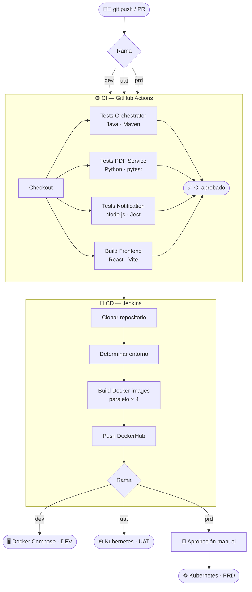

# Sistema de Facturación Electrónica


## Grupo #3: Integrantes

- Luis Alfredo González Mercado
- Brian Maldonado
- Carlos Alberto Arevalo Martinez

## Descripción

Prueba de concepto de arquitectura de microservicios para generación y envío de facturas electrónicas. Demuestra interoperabilidad entre servicios en **Java, Python y Node.js** con comunicación síncrona y asíncrona.

## Documentación

- **[📐 Arquitectura C4](ARCHITECTURE.md)** - Diagramas completos del sistema (Contexto, Contenedores, Componentes, Código)
- **[🔧 Orchestrator Service](orchestrator-service/README.md)** - Microservicio principal (Java Spring Boot)
- **[📄 PDF Service](pdf-service/README.md)** - Generador de PDFs (Python FastAPI)
- **[📧 Notification Service](notification-service/README.md)** - Envío de emails (Node.js Express)
- **[🖥️ Frontend](frontend/README.md)** - Interfaz de usuario (React + Vite)

## Arquitectura

```
┌─────────────────┐
│    Frontend     │
│   React + Vite  │ :5173
└────────┬────────┘
         │ HTTP REST
         ▼
┌─────────────────────────────────┐
│   Orquestador                   │
│   Java Spring Boot              │ :8080
│   - Validación + BD SQLite      │
└────┬──────────────────────┬─────┘
     │ Síncrona             │ Asíncrona
     ▼                      ▼
┌──────────────┐      ┌──────────────┐
│  PDF Service │      │  Email Svc   │
│  Python      │:8081 │  Node.js     │:8082
└──────────────┘      └──────────────┘
```

## Inicio Rápido

### Con Docker Compose (Recomendado)

```bash
# Iniciar todos los servicios
docker-compose up --build

# Acceder a la aplicación
http://localhost:5173
```

### Ejecución Local

```bash
# Orquestador
cd orchestrator-service && mvn spring-boot:run

# PDF Service
cd pdf-service && uvicorn app.main:app --port 8081

# Email Service
cd notification-service && npm start

# Frontend
cd frontend && npm run dev
```

## Tecnologías

| Componente | Stack | Puerto |
|-----------|-------|--------|
| Frontend | React 18 + Vite | 5173 |
| Orquestador | Java 21 + Spring Boot 3 | 8080 |
| PDF Service | Python 3.11 + FastAPI | 8081 |
| Email Service | Node.js 20 + Express | 8082 |

## APIs y Documentación

- **Orquestador**: http://localhost:8080/swagger-ui.html
- **PDF Service**: http://localhost:8081/docs
- **Frontend**: http://localhost:5173

## Configuración

### Variables de Entorno

Crea un archivo `.env` basado en `.env.example`:

```bash
# API Keys
ORCHESTRATOR_API_KEY=orchestrator-secret-key-123456789
PDF_SERVICE_API_KEY=pdf-service-secret-key-987654321
EMAIL_SERVICE_API_KEY=email-service-secret-key-abcdef123

# Gmail (para envío de emails)
GMAIL_USER=tu-correo@gmail.com
GMAIL_APP_PASSWORD=xxxx-xxxx-xxxx-xxxx
```

**Nota**: Para Gmail, genera una contraseña de aplicación en https://myaccount.google.com/apppasswords

## Conceptos Demostrados

### Patrones de Comunicación
- ✅ **Síncrona**: Orquestador → PDF Service (espera respuesta)
- ✅ **Asíncrona**: Orquestador → Email Service (fire-and-forget)

### Arquitectura
- ✅ **Polyglot**: Java, Python, Node.js en un mismo sistema
- ✅ **API Gateway Pattern**: Orquestador como punto de entrada
- ✅ **Service-to-Service Auth**: Validación con API Keys
- ✅ **Separación de responsabilidades**: Un servicio, una función

### Patrones sugeridos
- ⏳ Circuit Breaker
- ⏳ Retry Pattern
- ⏳ Message Queue (RabbitMQ/Kafka)
- ⏳ Service Discovery

## Probar la aplicación

1. Accede a http://localhost:5173
2. Completa el formulario de venta
3. Haz clic en "Realizar Venta"
4. Visualiza el PDF generado
5. Revisa el email enviado

## Troubleshooting

### Servicios no se comunican
```bash
docker-compose logs -f
```

### Error de API Key
Verifica que coincidan en `.env` y reinicia los contenedores

### Email no llega
- Usa contraseña de aplicación de Gmail (no tu contraseña normal)
- Revisa carpeta de spam
- Verifica logs: `docker-compose logs notification-service`

### Puerto en uso
```bash
# Windows
netstat -ano | findstr :8080

# Linux/Mac
lsof -i :8080
```

---

## CI/CD Pipeline

Este proyecto implementa dos pipelines: **CI con GitHub Actions** y **CD con Jenkins**.

### Estrategia de Ramas

| Rama  | Entorno     | Descripción                                       |
|-------|-------------|---------------------------------------------------|
| `dev` | Desarrollo  | Rama base. Integración de nuevas funcionalidades  |
| `uat` | Staging/UAT | Pruebas de aceptación antes de producción         |
| `prd` | Producción  | Versión estable, despliegue con aprobación manual |

```
feature → dev → uat → prd
```

### Diagrama del flujo CI/CD



### Pipeline CI — GitHub Actions (`.github/workflows/ci.yml`)

Se activa automáticamente en cada **push** o **pull request** a `dev`, `uat` o `prd`.

| Job | Servicio | Herramienta | Acciones |
|-----|----------|-------------|----------|
| `test-orchestrator` | Java Spring Boot | Maven + JUnit 5 | Compilar, testear, empaquetar JAR |
| `test-pdf-service` | Python FastAPI | pytest + httpx | Instalar deps, correr tests async |
| `test-notification-service` | Node.js Express | Jest + supertest | Instalar deps, correr tests |
| `build-frontend` | React + Vite | npm + Vite | Instalar deps, build de producción |
| `ci-summary` | — | — | Resumen final (solo si todos pasan) |

```
push/PR → checkout → setup runtimes → install deps → run tests → build → summary
```

### Pipeline CD — Jenkins (`Jenkinsfile`)

Gestiona el despliegue de las imágenes Docker según la rama activa.

| Stage | Descripción |
|-------|-------------|
| `Clonar Repositorio` | `checkout scm` — clona el código fuente |
| `Determinar Entorno` | Detecta `dev`/`uat`/`prd` y configura variables |
| `Construir Imágenes Docker` | Build paralelo de 4 imágenes (orchestrator, pdf, notification, frontend) |
| `Publicar Imágenes en DockerHub` | `docker push` con tag `BUILD_NUMBER-COMMIT` y `ENV-latest` |
| `Desplegar en Desarrollo` | `docker-compose up` (solo rama `dev`) |
| `Desplegar en UAT` | `kubectl set image` en namespace `invoice-uat` (solo rama `uat`) |
| `Aprobación para Producción` | Input manual requerido — 15 min timeout (solo rama `prd`) |
| `Desplegar en Producción` | `kubectl set image` en namespace `invoice-prd` (solo rama `prd`) |

```
Jenkinsfile CD:
  dev  → Build → Push DockerHub → Deploy Docker Compose (dev)
  uat  → Build → Push DockerHub → Deploy Kubernetes (invoice-uat)
  prd  → Build → Push DockerHub → [Aprobación Manual] → Deploy Kubernetes (invoice-prd)
```

### Configurar Jenkins (credenciales requeridas)

En Jenkins > Manage Credentials, agregar:

| ID | Tipo | Descripción |
|----|------|-------------|
| `dockerhub-credentials` | Username/Password | Usuario y token de DockerHub |

### Correr los tests localmente

**Java (Orchestrator):**
```bash
cd orchestrator-service
mvn test
```

**Python (PDF Service):**
```bash
cd pdf-service
pip install -r requirements.txt -r requirements-test.txt
pytest tests/ -v
```

**Node.js (Notification Service):**
```bash
cd notification-service
npm install
npm test
```

**Frontend:**
```bash
cd frontend
npm ci
npm run build
```

---

## Licencia

Proyecto académico - Universidad de La Sabana